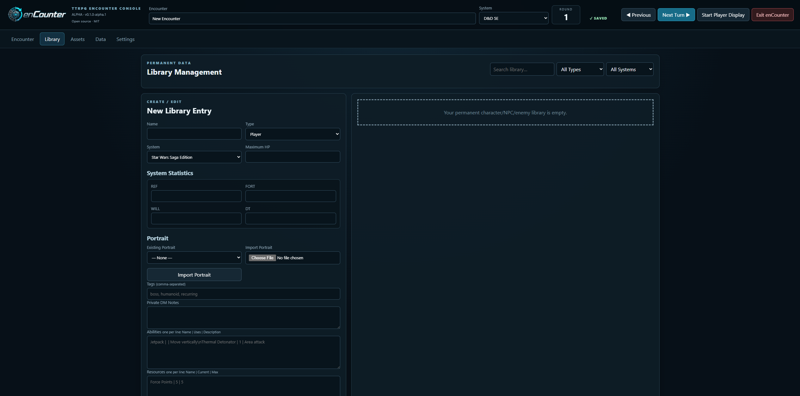
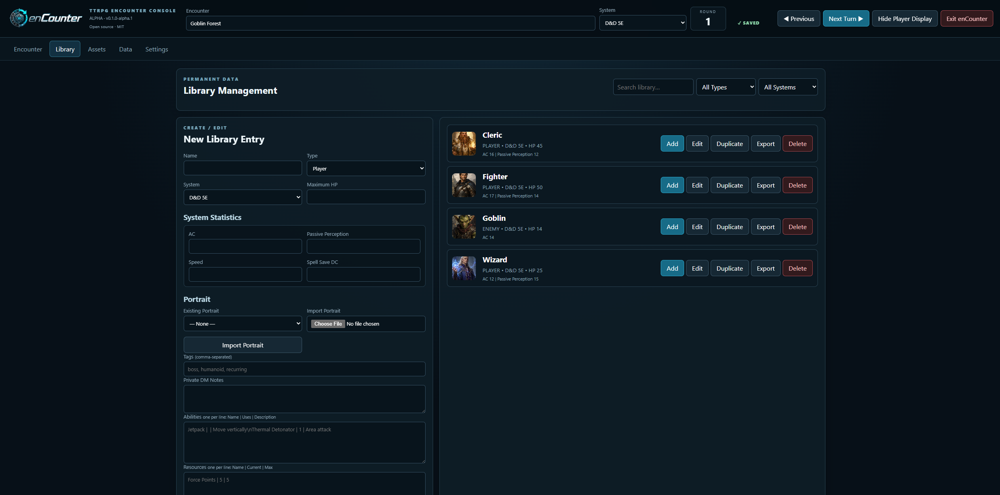
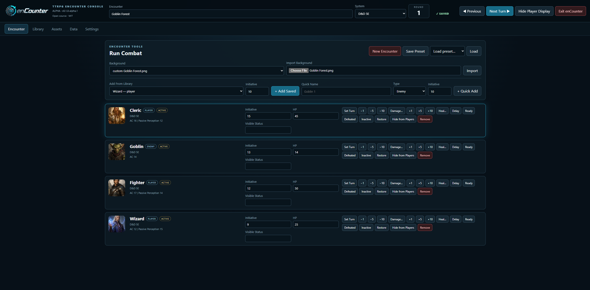
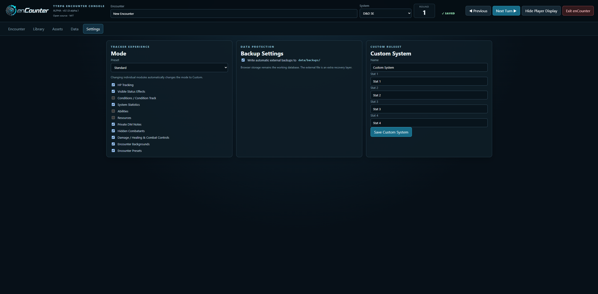
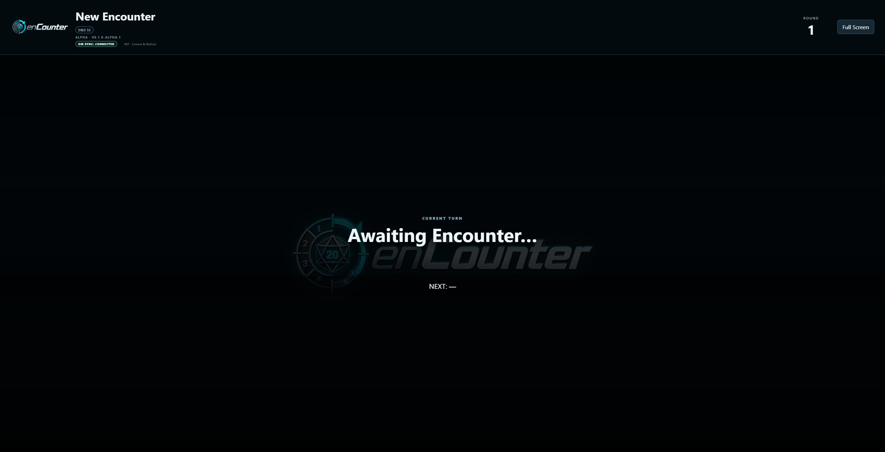
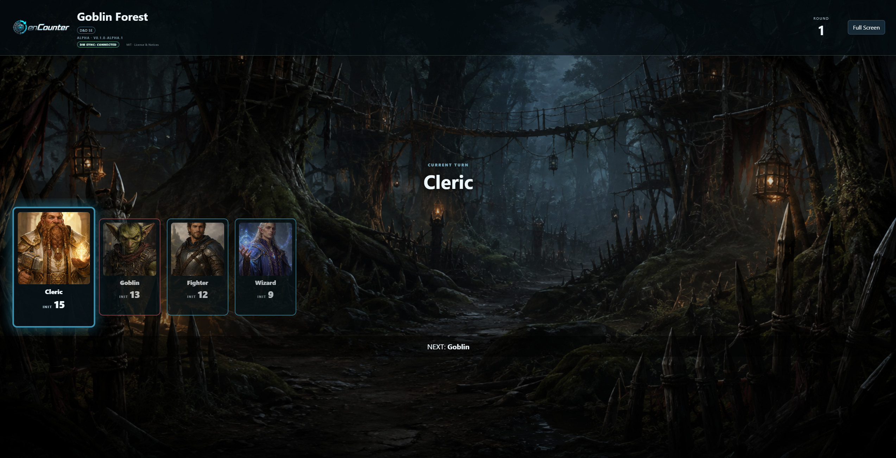
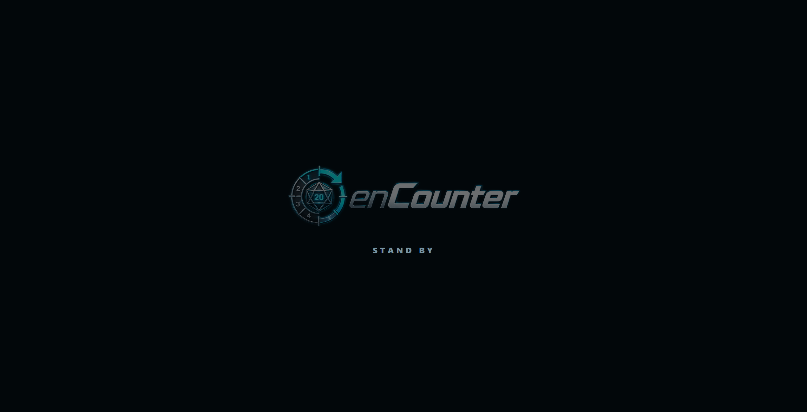

# enCounter

**enCounter** is a free, open-source, local-first TTRPG encounter and initiative manager with separate DM and Player Displays, reusable player/NPC/enemy/creature libraries, encounter controls, asset support, and local backup/export features.

**Current release:** `0.1.0-alpha.1`  
**Status:** Alpha / pre-release  
**License:** MIT  
**Platforms:** Windows and Linux

## Get enCounter

- **Download:** See the latest GitHub Release
- **Documentation:** See the enCounter User Guide in the `docs/` folder
- **Report a bug:** Open a GitHub Issue
- **Request a feature:** Open a GitHub Issue
- **Questions / setup help:** Use GitHub Discussions

> **Alpha software:** enCounter is currently under active development. Back up important Library and encounter data before upgrading between Alpha versions.

## Features

- Separate **DM Console** and **Player Display**
- One-button Player Display control:
  - **Start Player Display**
  - **Hide Player Display**
  - **Show Player Display**
- Private DM editing while the Player Display shows **STAND BY**
- Initiative and turn management
- HP, status, condition, and combatant controls
- Hidden enemies with **Hide from Players / Reveal to Players**
- Reusable Player, NPC, Enemy, and Creature Library
- Portrait and encounter-background support
- Generic TTRPG, SWSE, D&D 5E, and Custom system profiles
- Local autosave and recovery snapshots
- Backup, export, and import tools
- Windows and Linux portable builds
- Runs locally without requiring a cloud account

## Screenshots

### DM Console






### Player Display




### Player Display — Stand By



## Alpha notice

This is pre-release software. Features, storage structures, and behavior may change before version 1.0.

Use **Export Everything** before upgrading between Alpha builds when the stored Library or encounter data is important.

## AI assistance disclosure

enCounter has been developed with assistance from generative AI tools for coding, debugging, documentation, project organization, testing suggestions, and release preparation. AI-assisted material is reviewed and maintained by the project maintainer before release.

The current application does **not** include generative-AI functionality and does not intentionally send encounter, Library, or campaign data to an AI service.

See [`AI_ASSISTANCE.md`](AI_ASSISTANCE.md) for the full disclosure.

## Download / run

### Windows portable

1. Download the Windows portable ZIP from the matching GitHub Release.
2. Extract the complete ZIP to a normal writable folder such as Documents or Desktop. Do not run enCounter directly from inside the ZIP or from a protected system folder such as `Program Files`.
3. Double-click `enCounter.exe`.
4. enCounter opens in your default browser.
5. Click **Start Player Display** to open the player-facing display on a second monitor or TV.
6. Use **Hide Player Display** when you need to make private encounter or initiative changes.
7. Click **Show Player Display** when you are ready for players to see the updated encounter.
8. When finished, use **Exit enCounter** in the DM Console so the local background server closes cleanly.

Python is **not** required on the target computer when using the packaged Windows build.

The Alpha Windows executable is currently unsigned. Windows SmartScreen may therefore show an “unknown publisher” or reputation warning. Download builds only from the official project release and verify the published SHA-256 checksum when practical.

### Linux portable

1. Download the Linux `tar.gz` from the matching GitHub Release.
2. Extract it to a normal writable user folder.
3. Run `./enCounter` from the extracted folder, or double-click it if your desktop environment permits executable files.
4. enCounter opens in your default browser.
5. Click **Start Player Display** to open the player-facing display.
6. When finished, use **Exit enCounter** in the DM Console so the local background server closes cleanly.

Python is **not** required on the target computer when using the packaged Linux build.

If Linux reports that the file is not executable, run:

```bash
chmod +x enCounter
./enCounter
```

## Development and builds

Build-time requirements:

- Python 3
- PyInstaller (see `requirements-build.txt`)

Windows development start:

```text
Start enCounter.bat
```

Linux development start:

```bash
./Start\ enCounter.sh
```

Build a clean Windows portable release on Windows:

```text
Build enCounter Windows.bat
```

Build a clean Linux portable release on Linux (the archive name records the machine architecture):

```bash
./Build\ enCounter\ Linux.sh
```

PyInstaller builds are platform-specific. Build the Windows package on Windows and the Linux package on Linux. The build scripts intentionally exclude previous backups, imports, exports, campaign images, and browser Library data.

### Optional GitHub Actions builds

The repository also includes `.github/workflows/build-portable.yml`. After the repository is uploaded to GitHub, you can run **Actions → Build portable packages → Run workflow** to let GitHub build both Windows and Linux packages on the appropriate operating systems. The workflow also runs automatically when a version tag beginning with `v` is pushed.

## DM and Player Display workflow

Use **one DM Console tab/window at a time** for an encounter.

The Player Display should normally be opened from the DM Console using the same browser profile.

The Player Display button changes automatically depending on its current state:

| Button | Meaning |
| --- | --- |
| **Start Player Display** | Opens the Player Display |
| **Hide Player Display** | Replaces encounter information with a STAND BY screen |
| **Show Player Display** | Restores the Player Display using the latest encounter state |

### Making private DM changes

When **Hide Player Display** is selected, the player-facing screen displays a **STAND BY** screen.

The DM Console remains fully functional. The DM can privately:

- change initiative values
- add or remove combatants
- advance or correct turns
- change HP or status information
- add reinforcements
- hide or reveal enemies
- make other encounter adjustments

The Player Display continues receiving the latest encounter information internally but does not display those changes while hidden.

When the DM selects **Show Player Display**, the current encounter state is displayed immediately.

If the Player Display window is closed, the DM control returns to **Start Player Display**.

### Hidden combatants

When a combatant is marked **Hide from Players**, it remains fully visible in the DM Console but is completely omitted from the Player Display, including the initiative track and current/next-turn names.

Use **Reveal to Players** to return that combatant to the Player Display at its normal initiative position.

### Display synchronization

The Player Display includes a **DM Sync** connection indicator.

DM Console and Player Display windows must currently use the same browser profile. A different browser, different browser profile, or private/incognito session will not share the local synchronization channel.

Opening multiple DM Console windows against the same browser database is not supported in the current Alpha and may result in last-write-wins overwrites.

## Automated core tests

The repository includes dependency-free Node tests for normalization, initiative sorting, asset sanitization, and turn-transition behavior. Node.js is only needed to run these development tests; packaged enCounter users do not need Node.js.

Run them from the repository root with:

```bash
node --test tests/*.test.js
```

## Data and privacy

- Browser application data is stored locally in IndexedDB using `enCounterAlphaDB`.
- Optional disk backups are stored under `data/backups/`.
- Exports/imports and user-supplied assets remain local unless the user moves or shares them.
- The current Alpha binds its local web server to `127.0.0.1` and does not intentionally send encounter or Library data to an enCounter-operated cloud service.
- The local server exposes only the application files, public notices, and supported asset files needed by enCounter; runtime `data/` files and source/build files are not served through the browser.

See [`PRIVACY.md`](PRIVACY.md).

## Repository contents

The GitHub repository contains source code and build files. Compiled Windows and Linux packages belong in **GitHub Releases**, not in the source tree. Generated `build/`, `dist/`, and `release/` folders are ignored by Git.

## License

enCounter is released under the **MIT License**. See [`LICENSE`](LICENSE).

The MIT License permits use, modification, redistribution, sublicensing, and commercial use, provided the required copyright and license notice is retained. enCounter is provided without warranty as described in the license.

Copyright © 2026 **Zygons**.

## Bugs, feature requests, and support

enCounter is currently in Alpha and user feedback is welcome.

### Report a bug

Use **GitHub Issues → Bug Report** for reproducible problems with enCounter.

Please include, when possible:

- enCounter version
- operating system
- browser
- steps to reproduce the problem
- what you expected to happen
- what actually happened
- screenshots or error messages

### Request a feature

Use **GitHub Issues → Feature Request** for proposed improvements or new functionality.

### Questions and setup help

Use **GitHub Discussions** for:

- installation questions
- setup help
- usage questions
- general ideas
- workflows you want to discuss before requesting a feature

Please do not publish suspected security vulnerabilities as normal public Issues. See [`SECURITY.md`](SECURITY.md) for security reporting guidance.

## Contributing

See [`CONTRIBUTING.md`](CONTRIBUTING.md).

## Third-party names and materials

Names of third-party games, systems, products, companies, and trademarks remain the property of their respective owners. References are for identification or compatibility and do not imply endorsement, sponsorship, or affiliation.

See [`THIRD_PARTY_NOTICES.md`](THIRD_PARTY_NOTICES.md).
